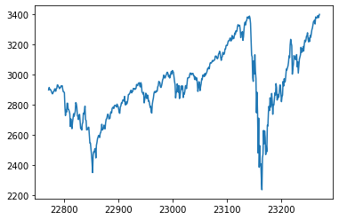
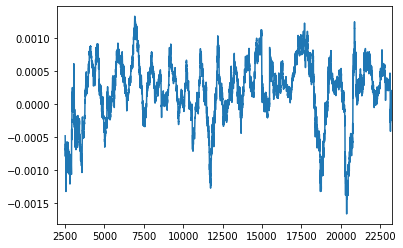
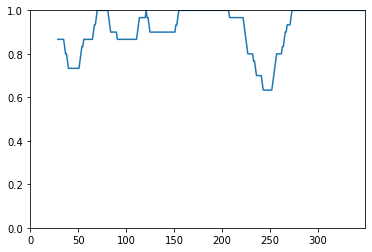

So I occasionally try to make predictions on the [forecasting Site Almanis](https://app.dysruptlabs.com) and some of their questions that reocurr every month are of the format: By X (DATE), will the S&P 500 fall below Index? (give concrete instead of general example?)


This notebook gives an answer to the question: What is the probability that the S&P 500 will exceed the index X within the next n days?

For example what is the probability that the 
Of course this probability can't be taken to be exact. To be precise, I looked at how 

This was useful for betting on questions on the betting Platform Almanis. Since the site asks those questions every month, I started to do this little analysis.


```python
import numpy as np
import pandas as pd
import matplotlib.pyplot as plt
import seaborn as sns
%matplotlib inline

df = pd.read_csv("^GSPC.csv")

```


```python
df.tail()
```


<div>
<style scoped>
    .dataframe tbody tr th:only-of-type {
        vertical-align: middle;
    }

    .dataframe tbody tr th {
        vertical-align: top;
    }

    .dataframe thead th {
        text-align: right;
    }
</style>
<table border="1" class="dataframe">
  <thead>
    <tr style="text-align: right;">
      <th></th>
      <th>Date</th>
      <th>Open</th>
      <th>High</th>
      <th>Low</th>
      <th>Close</th>
      <th>Adj Close</th>
      <th>Volume</th>
    </tr>
  </thead>
  <tbody>
    <tr>
      <td>23266</td>
      <td>2020-08-17</td>
      <td>3380.860107</td>
      <td>3387.590088</td>
      <td>3379.219971</td>
      <td>3381.989990</td>
      <td>3381.989990</td>
      <td>3671290000</td>
    </tr>
    <tr>
      <td>23267</td>
      <td>2020-08-18</td>
      <td>3387.040039</td>
      <td>3395.060059</td>
      <td>3370.149902</td>
      <td>3389.780029</td>
      <td>3389.780029</td>
      <td>3881310000</td>
    </tr>
    <tr>
      <td>23268</td>
      <td>2020-08-19</td>
      <td>3392.510010</td>
      <td>3399.540039</td>
      <td>3369.659912</td>
      <td>3374.850098</td>
      <td>3374.850098</td>
      <td>3884480000</td>
    </tr>
    <tr>
      <td>23269</td>
      <td>2020-08-20</td>
      <td>3360.479980</td>
      <td>3390.800049</td>
      <td>3354.689941</td>
      <td>3385.510010</td>
      <td>3385.510010</td>
      <td>3642850000</td>
    </tr>
    <tr>
      <td>23270</td>
      <td>2020-08-21</td>
      <td>3386.010010</td>
      <td>3399.959961</td>
      <td>3379.310059</td>
      <td>3397.159912</td>
      <td>3397.159912</td>
      <td>3705420000</td>
    </tr>
  </tbody>
</table>
</div>


```python
SP = df.Close
```


```python
SP.head
```


    <bound method NDFrame.head of 0          17.660000
    1          17.760000
    2          17.719999
    3          17.549999
    4          17.660000
                ...     
    23266    3381.989990
    23267    3389.780029
    23268    3374.850098
    23269    3385.510010
    23270    3397.159912
    Name: Close, Length: 23271, dtype: float64>


# old data gets removed


```python
sp = SP[1996:]
sp_1 = sp - sp.shift()
def shift_n(ts, n):
    ts_shift = []
    for i in range(1,n+1):
        ts_shift.append((ts - ts.shift(periods=i))/ts)
    return ts_shift
```


```python
SP.index = pd.to_datetime(df.Date)
```


```python
sns.lineplot(x=sp.index[-500:], y = sp.values[-500:])
```


    <matplotlib.axes._subplots.AxesSubplot at 0x248b828b548>


    

    


```python
n = 15 # the number of days that the S&P has to stay within the boundary
boundary = 3400
#sp = sp[:-1] #remove close
```


```python
sp_shift = shift_n(sp, n)
sp_shift = pd.DataFrame.from_dict(dict(zip([str(x) for x in range(1,n+1)],sp_shift)))
sp_shift = sp_shift[n:]
```


```python
sp_shift["1"].rolling(window=500).mean().plot()
```


    <matplotlib.axes._subplots.AxesSubplot at 0x248b82ef088>


    

    


```python
sp[-5:]
```


    23266    3381.989990
    23267    3389.780029
    23268    3374.850098
    23269    3385.510010
    23270    3397.159912
    Name: Close, dtype: float64


```python
sp[-1:]
```


    23270    3397.159912
    Name: Close, dtype: float64


```python
sp_pre_forecast = float(sp[-1:]) + sp_shift * float(sp[-1:])
```


```python
# "windows" is the number of days we look back in time how values
# were excedet in the past

windows = 350
sp_forecast = sp_pre_forecast[len(sp_pre_forecast)-windows:]
```


```python
float(sp[-1:])
```


    3397.1599119999996


```python
#computing the probability of exceeding "boundry"

win = []
if float(sp[-1:]) < boundary:
    print("probability of going above boundary")
    for i in range(len(sp_forecast)):
        win.append(any(sp_forecast.iloc[i] > boundary)) 
else:
    print("probability of going below boundary")
    for i in range(len(sp_forecast)):
        win.append(any(sp_forecast.iloc[i] < boundary))

win = pd.Series(win)
print(win.mean())
win.rolling(window=30).mean().plot()
axes = plt.gca()
axes.set_ylim([0,1])
plt.show()
```

    probability of going above boundary
    0.9228571428571428
    


    

    

